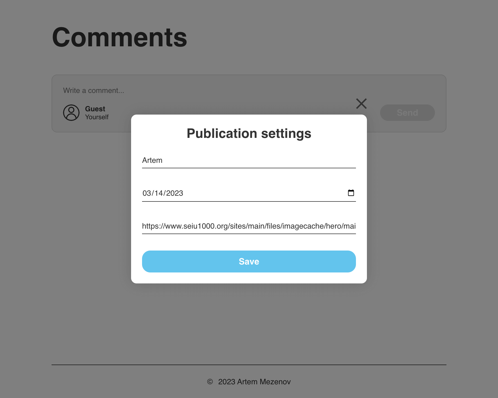

# Проект "comments-add-form"

## To run the project use - "make run".

### Screen demonstration:

### Functional:
* Adding and deleting a comment
* Like and unlike comments
* Display the number of likes of a comment
* Display number of comments
* Call pop-up window for profile editing
* Call a pop-up window to confirm the deletion of a comment
* Edit user profile
* User avatar update
* Validation of all forms

### Pop-up window for profile editing:

### Pop-up window to confirm deletion of a comment:

### Features:
* Responsive layout
* All text is overflow protected
* Optimized icons
* All fonts are included in the project

### Supported Browsers:
* edge from "17"
* ie from "11"
* firefox from "50"
* chrome from "64"
* safari from "11.1"

### Technologies:

* OOP
* BEM methodology
* BEM Nested file structure
* HTML
* SASS
* JavaScript
* webpack
* Flexbox
* Grid Layout
* Git

### Language:

* English
